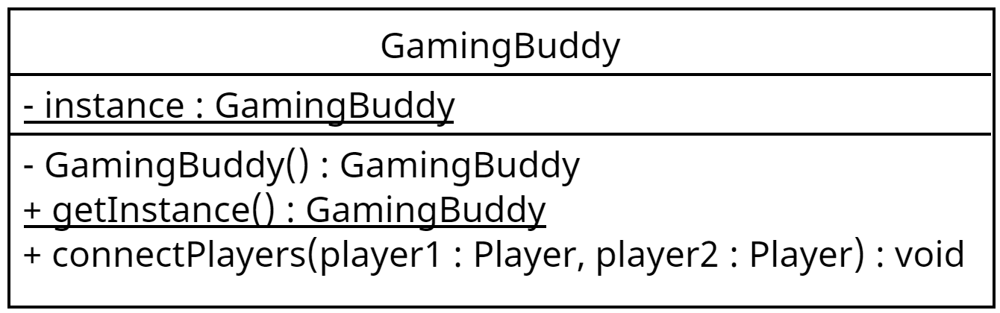
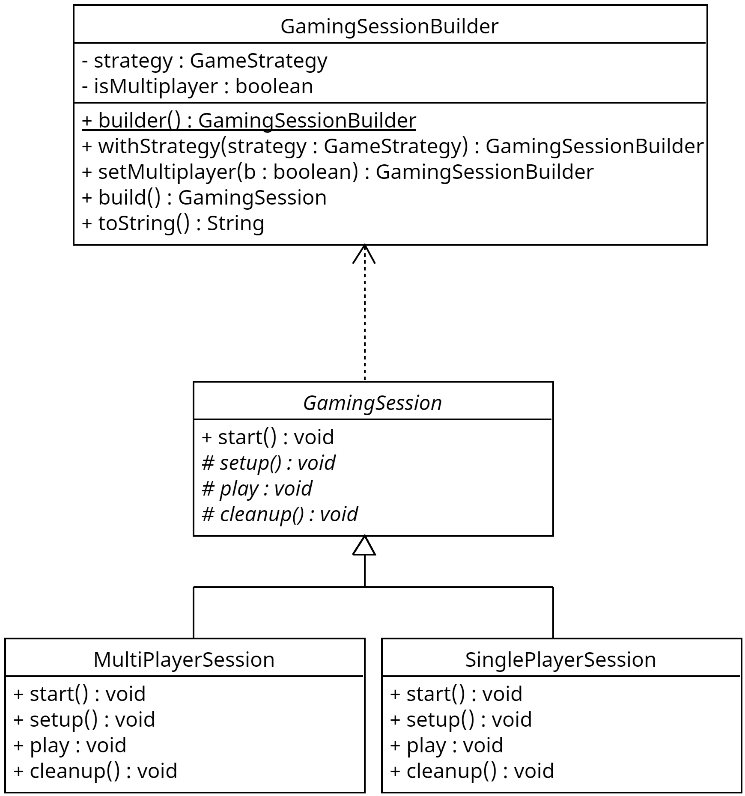

# Documentation
Throughout the design process, nine patterns were found to be of great use for the Gaming Buddy system: 

1. Singleton
2. Factory
3. Observer
4. Decorator
5. Command
6. Strategy
7. Builder
8. Template
9. Facade

Where each pattern was implemented will be explored further in this document.

## GamingBuddy
The GamingBuddy class is the primary class that players will connect through, therefore it's important that only one instance of it exists at a time. Because of requirement, the singleton pattern was used when designing this aspect of the class. To save resources, the lazy instantiation was used. Figure 1 below shows the UML diagram for this implementation.

*Figure 1. Implementation of Singleton pattern in GamingBuddy class*

Some players may want all features available in their sessions while others may only want a select few. Instead of making subclasses for each different combination of features, the decorator pattern was chosen to allow for custom choices of features. This pattern also facilitates adding new features in the future as long as they adhere to the GamingBuddyInterface. Figure 2 shows the current implementation of some basic functionality for the GamingBuddy class

*Figure 2. Implementation of Decorator pattern for GamingBuddy*

## Player
Similar to the GamingBuddy class, the Player class has more than one pattern associated with it. Due to the three different types of possible Players, casual, competitive, and professional, the Factory pattern was used to create Player objects. This facilitates adding different types of Players later on in development and also isolates the building of Players from client code.

The other pattern that has been used for the Player class is the Observer pattern. This allows other players and parts of the Gaming Buddy system to be updated on a change in a Players state without allocating resources to monitoring that Player. Currently the feature has been implemented to notify all Players that another Player has joined the lobby. However, more functionality can be added later in the development process to notify players about various other changes in attributes.

Both the Factory and Observer pattern implementations can be seen below in Figure 3.

*Figure 3. Implementation of Factory and Observer pattern for Player*

## Command
The next design pattern that has been implented is the Command pattern. This pattern provides functionality while also potentially keeping a record of requests made in the system. There are currently two working commands in the system, the InvitePlayerCommand and StartSessionCommand. The commands are executed by the CommandInvoker class. Figure 4 below shows the UML diagram of this implementation

*Figure 4. Implementation of Command pattern*

## GamingSession
The next two implemented design patterns are used in the GamingSession module. There are two different types of GamingSessions, multiplayer and singleplayer.The Template pattern makes the two sessions follow the same functional structure, but allows them to implement according to their needs.

The second pattern, the Builder pattern, retains the same contruction process for different representations of a complex object. The implementations of both patterns can be found below in Figure 5.

*Figure 5. Implementation of Template and Builder pattern*

## GamingStrategy
The next pattern allows different implementations of an algorithm at runtime. The GamingStrategy class implements this so that players can decide if they want to play in the same game as friends or play singleplayer. The implementation of this pattern can be seen below in Figure 6.

*Figure 6. Implentation of Strategy pattern*

## Facade
Finally, due to the complicated nature of the various subsystems, the Facade pattern was used to facilitate use of the subsystems as well as to decouple client code from subsytem code. The pattern can be seen below in Figure 7, which shows a simplified version of the various system modules.

